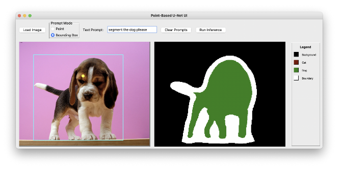
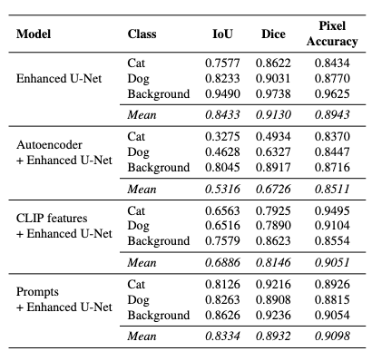
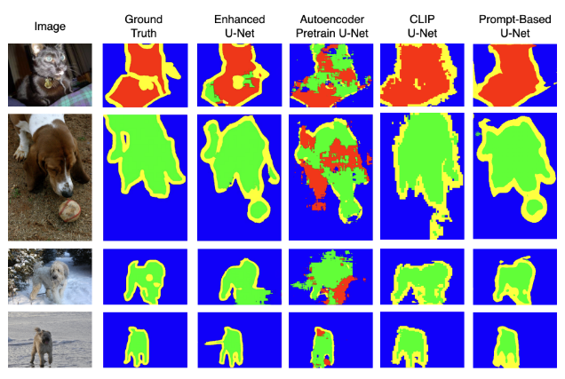

# Investigating U-Net Designs and Extensions for Semantic Segmentation

This project explores an **enhanced U-Net** for image segmentation, integrating **residual connections** and **attention mechanisms**. We also investigate three extensions to the U-Net architecture:

1.  Autoencoder pretraining
2.  CLIP visual encoder
3.  Prompt-based segmentation

All models are evaluated on the **Oxford-IIIT Pet dataset**.

## Models

- **Enhanced U-Net**: The core model, featuring an encoder-decoder architecture with residual connections and attention gates for improved accuracy.
- **Autoencoder + U-Net**: The encoder of the U-Net is pretrained as an autoencoder to reconstruct input images before being used for the segmentation task.
- **CLIP + U-Net**: The U-Net's encoder is replaced with a pretrained CLIP visual encoder for feature extraction.
- **Prompt-Based U-Net**: This model uses spatial (point and box) and textual prompts to guide the segmentation process.

## User Interface

An interactive Gradio UI is available in `app.py`.



## Results

### Evaluation Metrics

The Enhanced U-Net achieves the strongest overall performance, while the Prompts + Enhanced U-Net closely follows. Both the CLIP features + Enhanced U-Net and Autoencoder + Enhanced U-Net show comparatively lower segmentation performance. The results are further analysed in our report.



### Mask Visualisation

Below are some examples of the segmentation masks produced by the models.



## How to Use

### Training

To train a model, run the corresponding script in the `src/training` directory. For example, to train the enhanced U-Net, run:

```bash
python src/training/train_class_weighted.py
```

### Evaluation

To evaluate a trained model, run the corresponding script in the `src/evaluation` directory. For example:

```bash
python src/evaluation/evaluation.py
```

### Robustness Evaluation

We tested the models' robustness against various image perturbations, including:

- Gaussian Noise
- Gaussian Blur
- Contrast & Brightness Changes
- Occlusion
- Salt & Pepper Noise

To run the robustness evaluation, use the `robustness_exploration.py` script in the `src/robustness` directory. The results can be visualized using the `robustness_plot.py` script.
